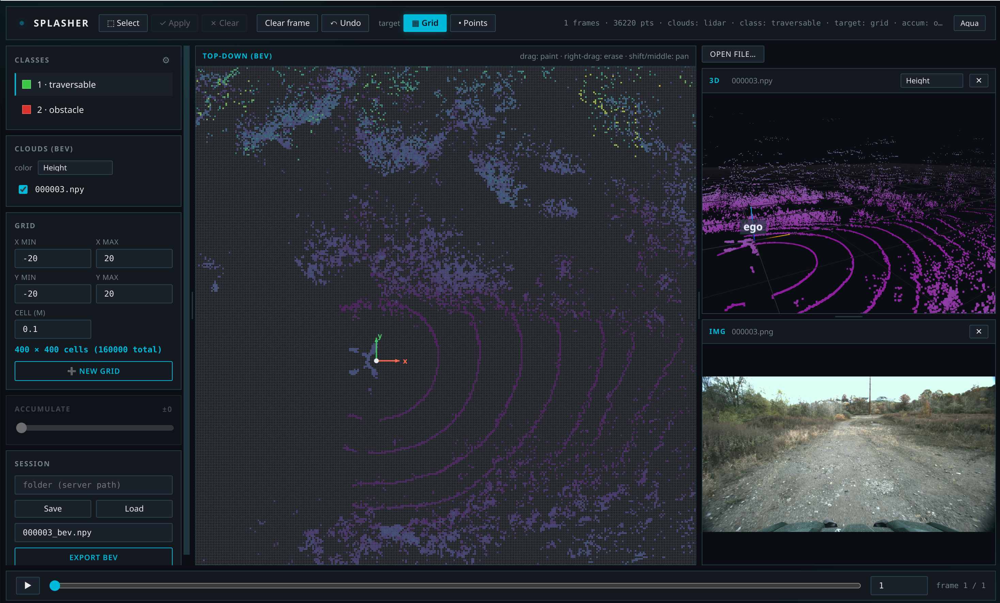

<div align="center">


# Splasher

**Label synchronized channels — 3D point clouds, camera images — into a top-down BEV grid or per-point labels.**

[](https://github.com/augustin-bresset/splasher/actions/workflows/ci.yml)
[](LICENSE)
[](pyproject.toml)
[](https://github.com/astral-sh/ruff)
[](https://huggingface.co/spaces/SmaugC137/splasher)

[**▶ Live demo**](https://huggingface.co/spaces/SmaugC137/splasher) · [**Sibling tool: Toaster**](https://github.com/augustin-bresset/toaster) · [Quick start](#quick-start)

</div>

<p align="center">
  
</p>

---

**Splasher** is a **labeling app** with a generic core: you give it a *synchronous dataset* —
at each timestamp, a **pack of named channels** (3D point cloud, camera image, pose, …) — and
you label either a **top-down 2D grid (BEV)**, the **3D points** directly, or both.

First use case: **traversability**. But nothing is hard-wired: no imposed class schema, no
imposed world semantics, and **no mandatory dependency on any dataset format**.

## The app

A **dark, brutalist black-&-blue desktop app**. You roam freely in the 3D cloud, look at the
camera images, and paint labels on a top-down (BEV) view:

- **3D / camera panels you can add, resize, and each bind to a channel** (color-by:
  height / intensity), plus a labelable **top-down BEV view** (underlay: height / density /
  intensity). Sensor placements (`ChannelSpec.placement`) are drawn as markers in 3D, and an
  **ego marker** (X = forward, Y = left) anchors both the BEV and the 3D views to the same
  axis convention.
- **Channels dock**: show/hide each cloud or camera available in the source (multiple cameras
  and clouds supported).
- **Fully editable classes** (⚙ in the *Classes* panel). Three.js is hosted locally
  (`splasher/web/vendor`) → **works offline**.

**How you label:**

- **Draw the grid of cells** (top-down): its extent and cell size, created explicitly via
  **"New grid"**. Undo is **per frame**.
- **Drag a rectangle** on the top-down view. Depending on the target:
  - **Grid** → fills the covered cells with the active class (output = raster of IDs).
  - **Points** → assigns the class to the 3D points in the rectangle (output = per-point labels).
- Interaction: **left-drag = apply**, **right-drag = erase / deselect**,
  **Shift-drag or middle-button = pan**, **wheel = zoom**.
- **Selection** mode (desktop-style): left-drag adds cells to the selection, right-drag
  removes them (non-contiguous selections allowed), then **apply** the class to the whole
  selection at once. Changing the grid asks for **confirmation** if a labeling already exists.
- **Accumulation**: accumulate ±N frames **registered by their poses** into the current
  frame's frame of reference (a denser cloud helps labeling). The grid and labels stay **per
  frame**: a brush stroke on the accumulated cloud is **de-accumulated** back to each source
  frame. (Requires a `POSE` channel.)

## Quick start

```bash
git clone https://github.com/augustin-bresset/splasher && cd splasher
uv sync --extra app     # the desktop app (FastAPI + uvicorn + pywebview)
```

```bash
splasher demo           # ← the app: native window on a synthetic dataset (zero external data)
splasher                # empty: file-viewer mode (browse & open clouds/images)
splasher demo --serve   # same app in the browser instead → http://127.0.0.1:8077
```

> **Native window out of the box:** the `app` extra ships a Qt WebEngine (Chromium) backend,
> so `splasher demo` opens a real native window with no system packages to install. If no
> backend can start, it falls back to the default browser and keeps serving.

Other extras: `uv sync` (core + engine only, numpy) · `uv sync --extra apairo` (the apairo
input adapter).

## File-viewer mode

Launched empty (`splasher`), *Open file…* browses the filesystem (type a path, **Tab** to
complete) and opens point clouds (`.npy`/`.bin`/`.pcd`) and images (`.png`/`.jpg`/… or
`.npy` `HxWxC`) into resizable views. The **Clouds (BEV)** panel selects which open clouds
feed the BEV (multiple = combined), with a color mode (height/intensity/normal). The BEV grid
and its labels are **independent** of the displayed cloud — switching/combining clouds never
wipes them. **Export** writes the grid raster to a single `.npy` (default name
`<cloud>_bev.npy`); **Save** writes a full session folder.

## Input & adapters

The core consumes a `Source`: `__len__`, `__getitem__(i) -> Frame`, `channels()`.
`ArraySource` builds one from in-memory numpy arrays. `ApairoSource` (`apairo` extra) wraps
any synchronous apairo dataset.

```bash
uv sync --extra apairo --extra app                     # adapter + desktop
splasher /path/to/dataset --adapter apairo             # all channels
splasher /path/to/dataset --adapter apairo --channels lidar,cam_front,pose   # only these
splasher /path/to/dataset --adapter apairo --reference lidar --tolerance 0.05  # sync an async dataset
```

Two ways to pick what you work on: **load everything** (a synchronous dataset) and choose what
to *display* in the UI (the *Clouds (BEV)* toggles + **Add view** per channel), or **select
channels at load time** with `--channels a,b,c`. An asynchronous dataset needs `--reference
<channel>` (and optionally `--tolerance`) to be synchronized first.

## Architecture (swappable GUI)

Layers from generic to specific — each depends only on the previous one:

```
splasher/
  core/      pure numpy model (grid, label targets, BEV projection, accumulation…)
  engine/    headless Session: all the state + operations, with no UI dependency.
             Returns a *semantic* ViewState (points + per-point labels + channel,
             BEV field, grid raster, selection, images) — not pixels.
  server/    FastAPI backend on the same Session + serves the web front; desktop app.
  web/       web front (vanilla, zero build) — the ONLY front (packaged in the wheel).
    vendor/  Three.js hosted locally (offline).
```

**One front, one engine.** The web front is served by the backend; the desktop app
(`splasher` without `--serve`) opens that same front in a **native webview** (pywebview,
Spotify/Electron style) — so the desktop *is* the web front, in a window. The `Session`
(`splasher.engine.Session`) draws nothing: it exposes `view_state()` + commands
(`paint_rect`, `select_rect`, `apply_selection`, `set_frame`, `commit_grid`, `save`/`load`, …),
and colorization stays on the front side.

<details>
<summary><b>REST API</b> — optional, for driving Splasher from your own front or scripts</summary>

<br>

`splasher demo --serve [--host H --port P]` starts a FastAPI server driven by the same
`Session` as the desktop app. Each command returns the updated `ViewState` so a front renders
in a single round-trip:

| Method | Route | Purpose |
|--------|-------|---------|
| `GET`  | `/api/session` | ~static description (channels, classes, n_frames) |
| `GET`  | `/api/view`    | current render state |
| `POST` | `/api/frame`, `/api/class`, `/api/tool`, `/api/targets`, `/api/accum`, `/api/visibility` | settings |
| `POST` | `/api/paint`, `/api/select`, `/api/selection/apply`, `/api/selection/clear`, `/api/clear`, `/api/undo` | labeling |
| `POST` | `/api/grid`, `/api/save`, `/api/load` | grid & I/O |

numpy arrays travel as `{dtype, shape, data(base64)}` (`splasher.server.protocol`), decodable
directly into a `TypedArray` on the JavaScript side. Interactive docs at `/docs`.

</details>

## Development

```bash
uv sync --extra api          # core + engine + server (for the test suite)
uv run --extra api pytest -q # run the tests
```

The core/engine import without any UI dependency; tests are pure-numpy + FastAPI's
`TestClient`. CI runs the suite on Python 3.11 and 3.12 (`.github/workflows/ci.yml`).

## Related project

**[Toaster](https://github.com/augustin-bresset/toaster)** — a sibling labeling tool by the
same author, for **3D lidar point clouds**: walk through a cloud, select points by hand or by
zone, and plug in any model that *groups* points (clustering like DBSCAN, or neural-net
inference) so that **clicking one cluster labels the whole group at once**. The two share the
same spirit and design: Splasher focuses on the **BEV grid / synchronized multi-channel**
angle, Toaster on **model-assisted 3D point** annotation.
